[](https://classroom.github.com/a/_e9whi2b)

# About Projects

### Dimy Landing page

Click Here to access the project : 
- Netlify : [Revou Milestone 1 Assignments](https://yuliussmayoru.online/)

#### I. Project Description
> created to complete revou milestone 1 assignment, the page functioned as landing page of the company, as a preview about what has been achieved by the company, to help customer reach out the company to help them to create a tech product, and also to inform people with talent about job apportunity to join the team.


#### II. Project Requirements

for current Project Revou team gave several requirements need to be fullfiled
> 1. Semantic HTML
> 2. Responsive Design using vanilla css
> 3. Create Documentation regarding creating the web from scratch till deployed on netlify
> 4. Deployment 

this Project Created to Fullfiled those requirement. and sepesificly this Readme created to fullfiled Project Requirements number 3.

#### III. How to run the Project

1. Clone this project to local by copying https://github.com/revou-fsse-3/milestone-1-yuliussmayoru.git from github which located at this picture below

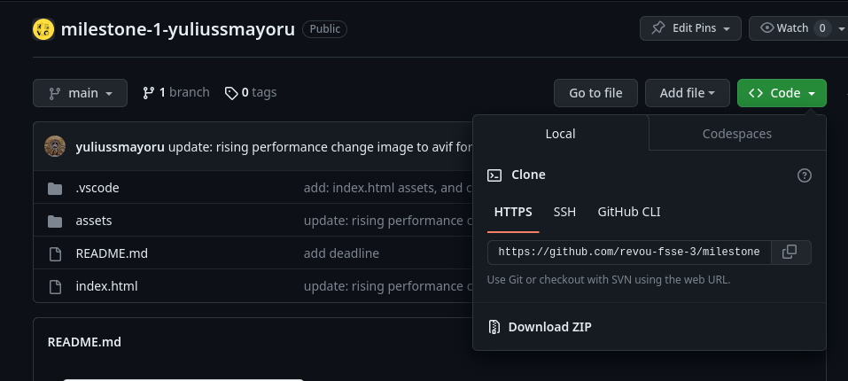

2. Running the terminal and access the project like picture example below, and open it with visual studio code

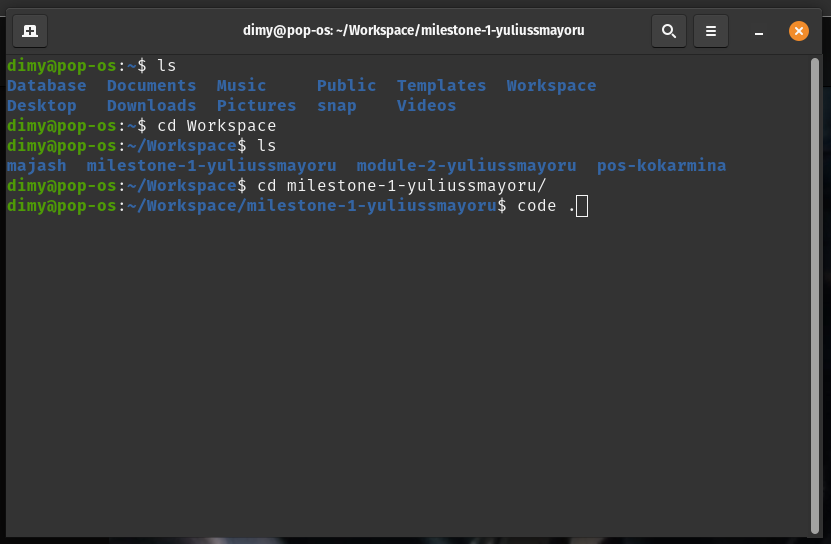

3. After visual code openend, open index.html and run the file with live server. if it's not installed, search the extention installed it, then run the index.html click Go Live at bottom right of visual studio code. if extension installed you'll find it like this image below.

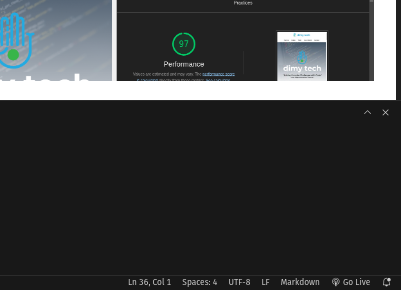

4. After you click Go live it would automatically open the browser. now you are running the project. 

#### IV. Landing Page Development
1. By default before the development start, I am following SDLC (Software Development Life Cycle) rules to make a website.
> * Planning
> * Design
> * Create the Website
> * Test
> * Delpoy

2. Planning.
> since the plan is to create web company profile for my own very own start up, first i am collecting content that need to be post on the company profile. and after sometimes collecting the data then i find several things i want to put it at the website and it is in the list below :
> * Company Value
> * Company Vision and Mission
> * Company Services
> * Company Portofolio
> * Company Work Process
> * About Company and for the last is,
> * Contacts to help viewers make a contact with the company.

3. Design
> For design i need to look for a template example since i have no capability doing the designing stuff. Thus, i am looking for a company web profile template. and i try to implement the layout for the website. You may check the template by accessing this website : http://www.abcgomel.ru/haswell/one-page-index.html . below is looks of the full page: 

4. Create the Website
> * Entering Web Development Session, I Create Project Folder, First I pull the project repository.  then I create Initial Project Repository like the picture bellow: 
> 
> * Then Start Writting the HTML file. using Semantics for better SEO. below is the picture of basic semantics html i am using for developing the website : 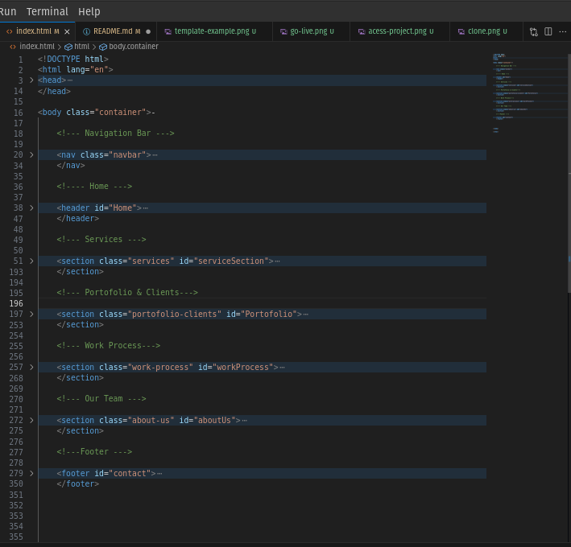
>
> * After finishing writting the Index.html i start to create the css for styiling. i decide with using Mobile First Approach to create the website. to make things easier, before the styling begin, I divide the css file based on their section and gave them proper name. so it would be easier to find where a code when there is something that need to be fixed. Thus, i divide the css like the image below :
> 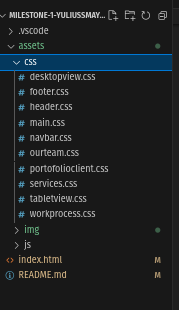
> Then I connect the css with @import, so the index.html no need to call every css file. but it's only need to call the main.css. here is is below is example of how i do it: 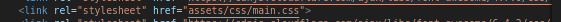
> below is how i import each css file to main.css 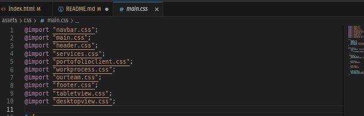
> Then I Create the Website based on template example.

5. Testing
> and To Test Several things that need to be worked, i am using Chrome Mobile Simulator Extension to make sure, the layout of the website is good to see on 3 type of device.
> * First the mobile view, i was using Iphine 13 PRO which has resolution : 390 x 844
> * Second the Tablet view, i was using Galaxy Tab S7 which has resolution : 800 x 1280.
> * Third and the Last, i was using Macbook Air which has resolution: 1280 x 800.
> Here is example of the mobile simulator extention : 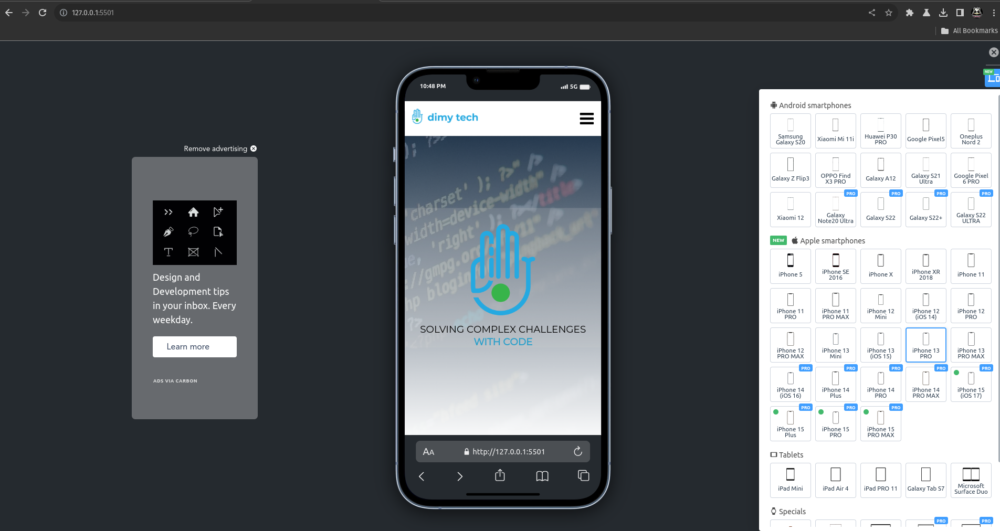

6. Deployment

> * First Login to Netlify for easier setup, use login with Github
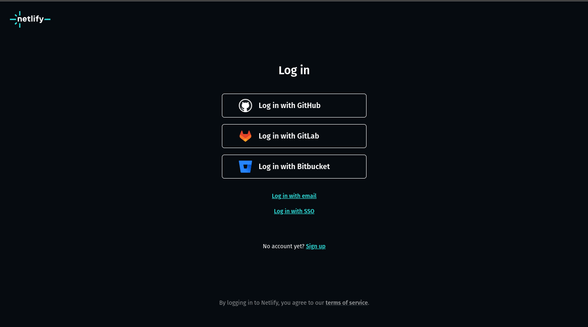
> * After Succesfully Logged in, Click Add New Site
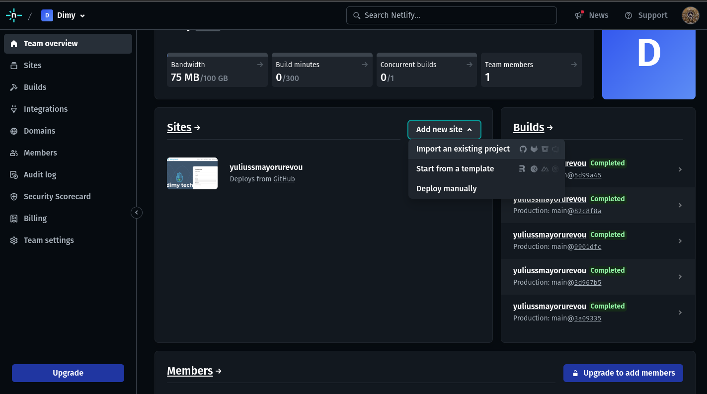
> * Then Click Deploy With Github
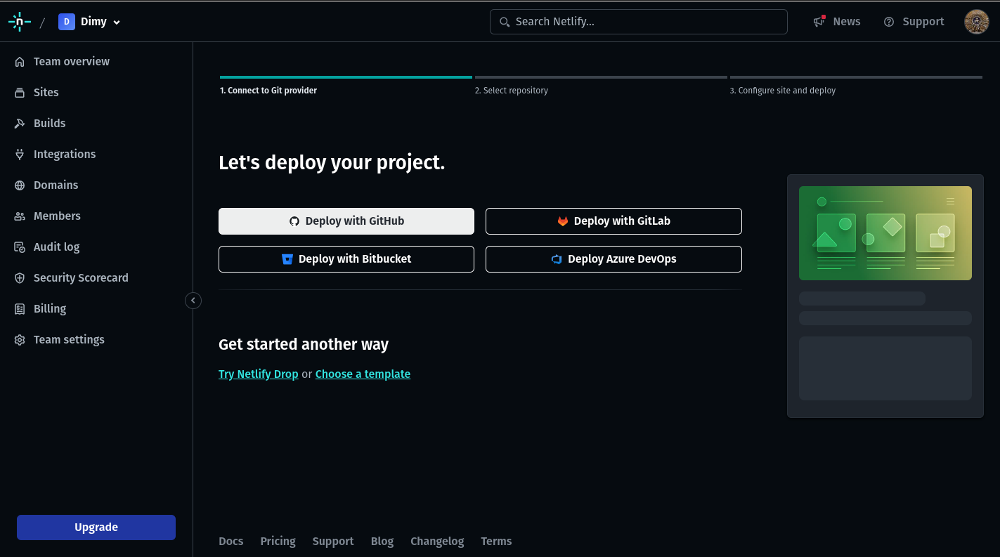
> * Then Select Repository Target like this step below
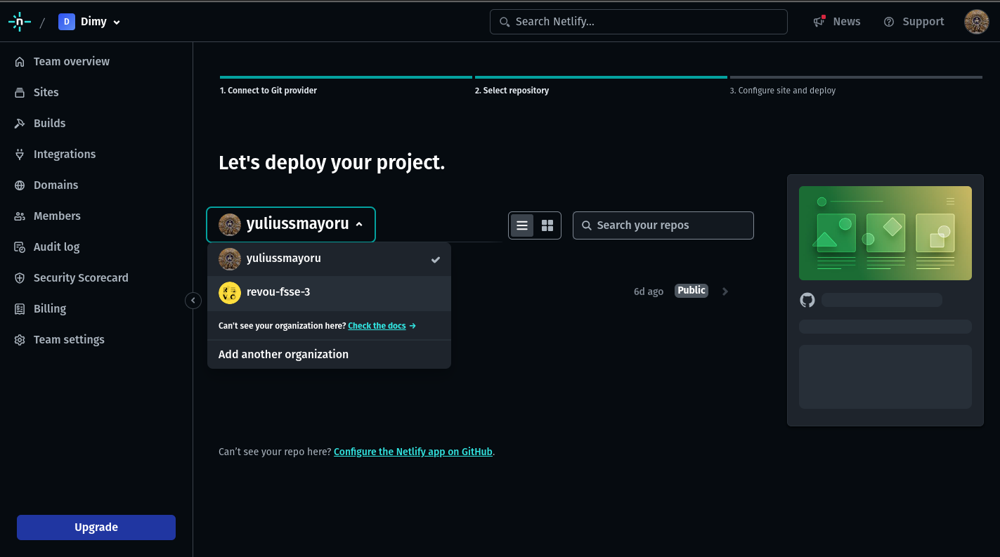
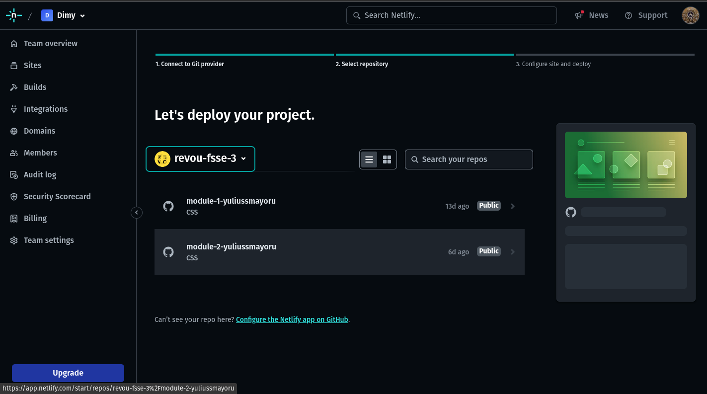
> * After that click Deploy
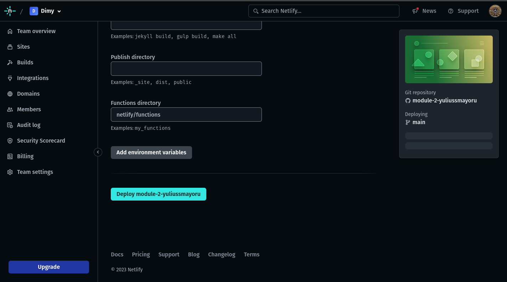
> * Click Setup Custom Domain or go to domain management
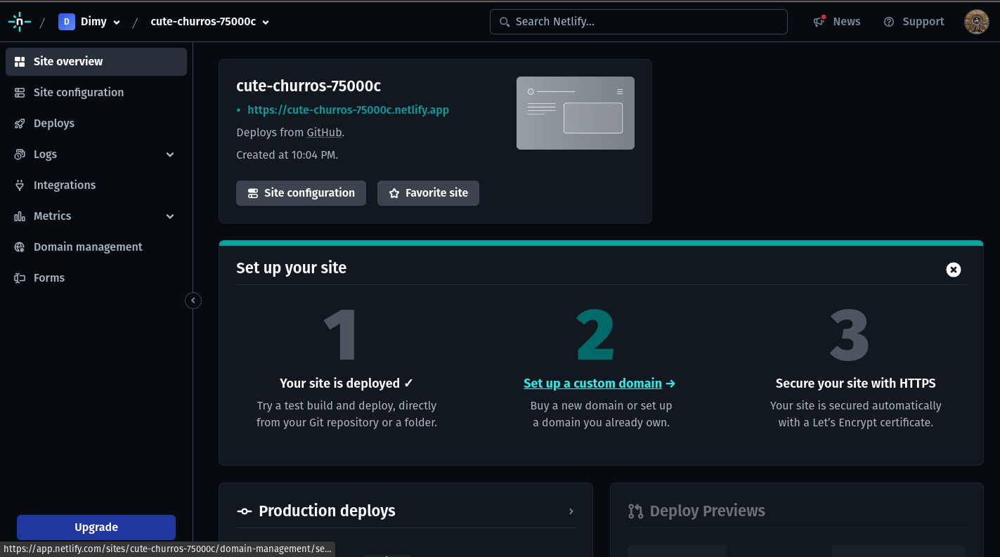
> * At Domain Management click add domain
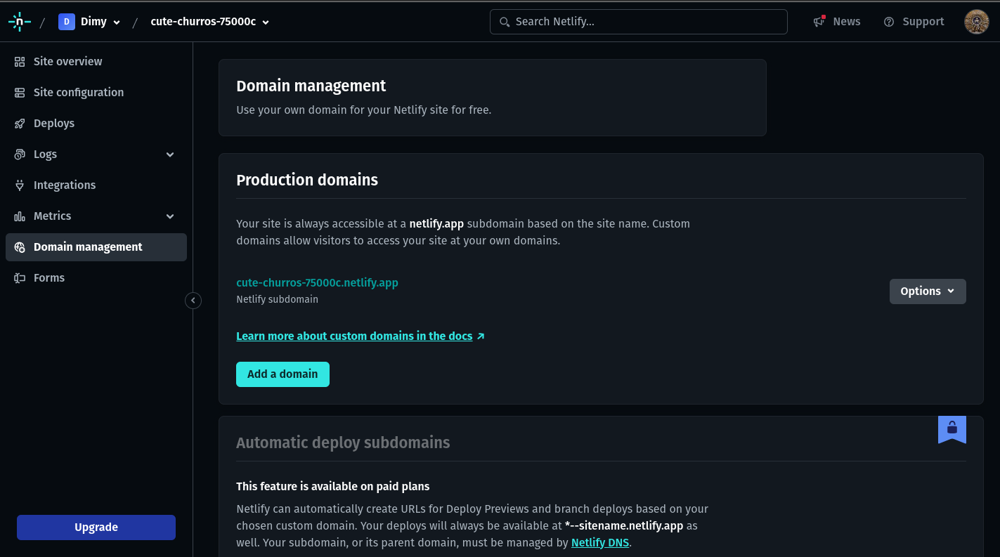
> * input domain name and clikc add domain
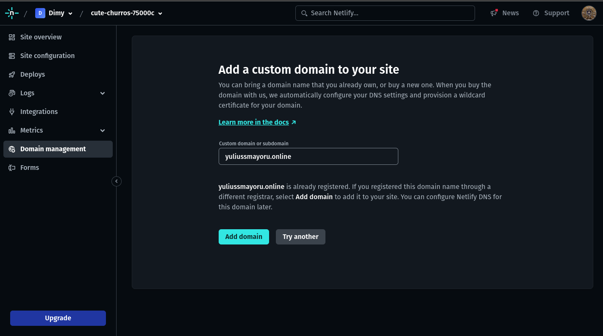
> * When you at this page click the Awaiting External DNS
copy all listed dns, then copy to domain provider in my case, it's niaga hoster
> * Login to Niaga Hoster then paste the DNS to Domain Configuration at Niaga Hoster and save like image below
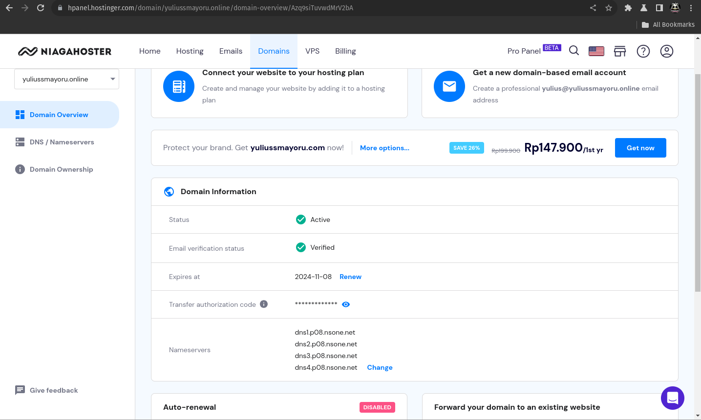

Then your deployment setup with setup domain has done. it would took some times for the domain applied to your web, so you may take a rest and wait.

####  IV. Author's Profile
> assignment for week 0 Introduction "My Profile" 
##### My Bio
Hi, I'm Yulius, Software Quality Assurance


i'm Software Quality Assurance, with more than 3 years experience who also a founder of Tech Startup in Bandung,
 
My main focus is Testing, Start from Regression Testing, Black Box Testing, Automation Testing API testing and UAT. but since i also a founder of tech startup, sometimes i have multiple role such as Project Manager, or Customer Satisfaction
 
##### My Links

- Instagram : [_athanasios.92](https://www.instagram.com/_athanasios92/)
- Linkedin : [Yulius Mayoru](https://www.linkedin.com/in/yulius-mayoru-a2491a20b/)
- Github : [yuliussmayoru](https://github.com/yuliussmayoru)

##### Product & Project Experience

below is 3 example of project i have been working in recent years. 

|No | Project / Product               | Image                         | Tech stack        |
|---|---------------------------------|-------------------------------|-------------------|
|1. |Qoligo & Kokarmina Point Of Sales|         | Nuxt.js & Nest.Js |
|2. |SIPPC Jaya Abadi                 |   | Nuxt.js & Laravel |
|3. |Pertiwi by PERTAMINA             | | ASP .Net          | 

and many more.

##### My Code Examples

##### javascript with cypress.io & cucumber (automation framework)

> this is my first time getting my hands on automation testing.
> the code below is to create automation for login and logout.

```javascript
import { Given, When, Then, And } from "cypress-cucumber-preprocessor/steps";


describe('User try to login Kokarmina Point of Sales in Condition Cashier has not been opened and try to logout after login', ()=> {
  Given ("visiting localhost:3000", ()=> {
    cy.visit("http://localhost:3000")
  })
  
  Then ("I should see login with pin form", ()=> {
    cy.get('[data-cy="login_form"]').should('exist')
  })
  
  When ("I enter correct pin as following", (datatable)=> {
    datatable.hashes().forEach(element =>{
      cy.get('[data-cy="login_pin"]').type(element.pin)
    })
  })

  Then ("I press the Open button", ()=> {
    cy.get('[data-cy="open"]').click()
  })
  
  Then ("login successful and redirect to Order Page by showing loading container", ()=> {
    cy.get('.loading-container').should('exist')
  })

  And ("System should cache data from database and store it in local storage", ()=> {

    // get current date function

    function getCurrentDate() {
      const currentDate = new Date()
      const year = currentDate.getFullYear()
      const month = (currentDate.getMonth() + 1).toString().padStart(2, '0')
      const day = currentDate.getDate().toString().padStart(2, '0')
      const formattedDate = `${year}-${month}-${day}`
      return formattedDate
    }
    const currentDate = getCurrentDate()
    cy.log(currentDate)

    function get90DaysAgo() {
      var today = new Date();
      var daysAgo = new Date(today.setDate(today.getDate() - 90));
      var year = daysAgo.getFullYear();
      var month = String(daysAgo.getMonth() + 1).padStart(2, '0');
      var day = String(daysAgo.getDate()).padStart(2, '0');
      return year + '-' + month + '-' + day;
    }
    const ninetyDayAgo = get90DaysAgo()
    cy.log(ninetyDayAgo)

    cy.request({
      method: 'POST',
      url: 'http://127.0.0.1:8001/api/auth/pin',
      body: {
        pin: '2121'
      }
    }).then((response)=> {
      expect(response.status).to.eq(200)
      expect(response.body).to.have.property('access_token')
      expect(response.body).to.have.property('token_type')
      expect(response.body).to.have.property('expires_in')

      const urls = [
        'http://127.0.0.1:8001/api/auth/user',
        'http://127.0.0.1:8001/api/pos_setting',
        'http://127.0.0.1:8001/api/driveronline',
        'http://127.0.0.1:8001/api/product?',
        'http://127.0.0.1:8001/api/product_package',
        'http://127.0.0.1:8001/api/product_category?',
        'http://127.0.0.1:8001/api/section',
        'http://127.0.0.1:8001/api/table_management',
        'http://127.0.0.1:8001/api/bank',
        'http://127.0.0.1:8001/api/promo',
        'http://127.0.0.1:8001/api/dynamic_promo',
        'http://127.0.0.1:8001/api/compliment',
        'http://127.0.0.1:8001/api/cityledger',
      ]

      function renderApiRequest(url) {
        cy.request({
             method: 'GET',
             url: url,
             body: {
               token : response.body.access_token
             }
           }).then ((response)=> {
             expect(response.status).to.eq(200)
             expect(response.body).to.have.property('data')
             cy.log(JSON.stringify(response.body))
           })
      }

      urls.forEach((url)=> {
        renderApiRequest(url);
      })
     
      cy.request({
        method: 'GET',
        url: 'http://127.0.0.1:8001/api/order',
        body: {
          token: response.body.access_token,
          begin_date: `${ninetyDayAgo}`,
          end_date: `${getCurrentDate}`,
          payed: 0
        }
      }).then ((response)=> {
        expect(response.status).to.eq(200)
        expect(response.body).to.have.property('data')
        cy.log(JSON.stringify(response.body))
      })

      cy.getAllLocalStorage().then((localStorageData)=> {
        cy.log(localStorageData)
      })
      
      cy.getAllSessionStorage().then((localSessionStorage)=> {
        cy.log(localSessionStorage)
      })
      cy.wait(15000)
    })
  })

  Given ('after Login', ()=> {
    cy.get('[data-cy="beginning_balance_modal"]').should('exist')
  })

  Then ('I should see Enter Beginning Balance Modal', ()=> {
    cy.get('[data-cy="begining_balance__back_page_button"]').should('exist')
    cy.get('[data-cy="begining_balance__logout_button"]').should('exist')
  })
  
  When ('I click logout button', ()=> {
    cy.get('[data-cy="begining_balance__logout_button"]').click()
  })

  Then ('I should logout from Kokarmina Point of Sales', ()=> {
    cy.get('[data-cy="login_form"]').should('exist')
  })
})

```
#### Selenium Java with Cucumber

> this is the code when i using selenium java to conduct automations test

```java
package StepDefinitions;

import java.time.Duration;

import org.openqa.selenium.By;
import org.openqa.selenium.WebDriver;
import org.openqa.selenium.WebElement;
import org.openqa.selenium.chrome.ChromeDriver;
import org.openqa.selenium.chrome.ChromeOptions;

import org.junit.Assert;
import io.cucumber.java.After;
import io.cucumber.java.Before;
import io.cucumber.java.en.And;
import io.cucumber.java.en.Given;
import io.cucumber.java.en.Then;
import io.cucumber.java.en.When;

public class login {
	ChromeOptions opt=new ChromeOptions();
	
	WebDriver driver = null;
	
	@Before
    public void setup() {
        opt.addArguments("--remote-allow-origins=*");
        opt.addArguments("--headless");
        System.setProperty("webdriver.chrome.driver", "src/test/resources/drivers/chromedriver.exe");
        driver = new ChromeDriver(opt);
        driver.manage().timeouts().implicitlyWait(Duration.ofSeconds(40));
        driver.manage().timeouts().pageLoadTimeout(Duration.ofSeconds(40));
        driver.manage().window().maximize();
        
        driver.navigate().to("http://localhost:3000");
    }
	
	@After
	public void end() {
		driver.quit();
	}
	
	@Given("^User accessing website URL$")
    public void user_accessing_website_url() throws Throwable {
	
		WebElement emailForm = driver.findElement(By.id("email"));
		
    }
	
	@When("^user enters email address \"([^\"]*)\"$")
    public void user_enters_valid_email_address_something(String validEmail) throws Throwable {
		
		WebElement emailForm = driver.findElement(By.id("email"));
		emailForm.sendKeys(validEmail);
		
    }

    @When("^User dont enter any credentials$")
    public void user_dont_enter_any_credentials() throws Throwable {
    	
    	WebElement emailInput = driver.findElement(By.id("email"));
    	WebElement passwordInput = driver.findElement(By.id("password"));
    	emailInput.sendKeys("");
    	passwordInput.sendKeys("");
;
    }

    @Then("^User should get succesfully login$")
    public void user_should_get_succesfully_login() throws Throwable {
    	
    	WebElement loginSuccessAlert = driver.findElement(By.xpath("//*[@id=\"swal2-title\"]"));
    	String loginSuccessAlertText = loginSuccessAlert.getText();
    	Assert.assertEquals("Login Berhasil", loginSuccessAlertText);
    			
    	WebElement qoligoAccess = driver.findElement(By.xpath("//*[@id=\"sidebar-wrapper\"]/div[1]/a"));
    	Assert.assertTrue(qoligoAccess.isDisplayed());
		
    }

    @Then("^login failed and user still at login page$")
    public void login_failed_and_user_still_at_login_page() throws Throwable {
    	
    	WebElement loginFailedAlert = driver.findElement(By.xpath("//*[@id=\"swal2-title\"]"));
    	String loginFailedAlertText = loginFailedAlert.getText();
    	Assert.assertEquals("Login Gagal", loginFailedAlertText);
    	
    	WebElement formLogin = driver.findElement(By.id("form-login"));
    	Assert.assertTrue(formLogin.isDisplayed());
    	
    }

    @And("^Enter password \"([^\"]*)\"$")
    public void enter_password_something(String validPassword) throws Throwable {
    	
    	WebElement passwordForm = driver.findElement(By.id("password"));
    	passwordForm.sendKeys(validPassword);
    	
    }

    @And("^Click on Login button$")
    public void click_on_login_button() throws Throwable {
    	driver.findElement(By.id("login_button")).click();
	}
    
    @Then("^user stay at login page$")
    public void user_stay_at_login_page() throws Throwable {
        
    	WebElement emailForm = driver.findElement(By.id("email"));
    	
    }

}
```
